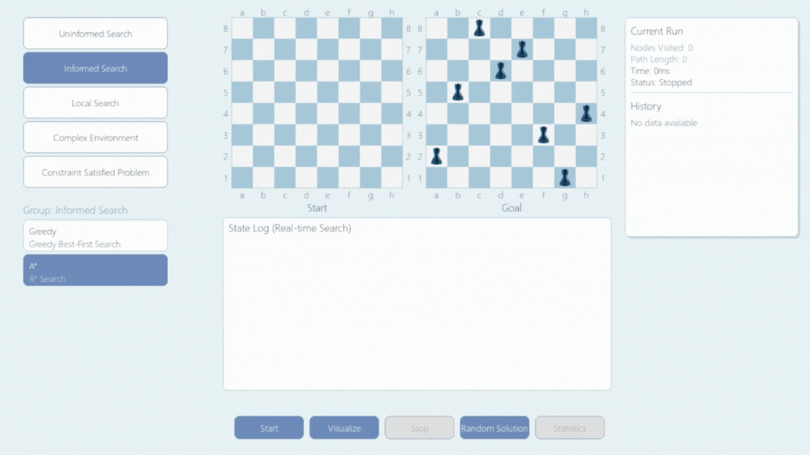
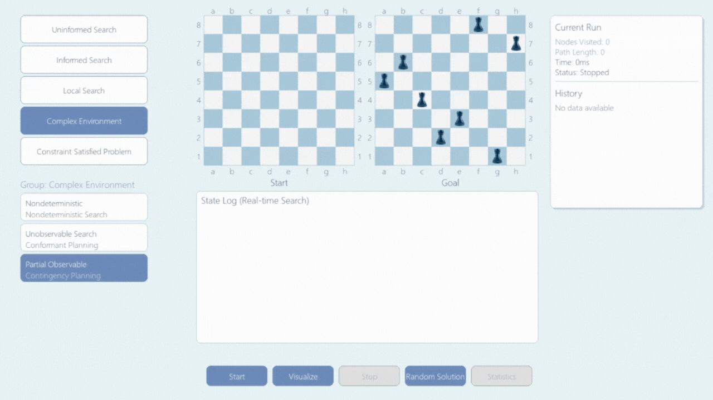

# BÁO CÁO BÀI TOÁN 8 QUÂN XE

**GVHD**: Phan Thị Huyền Trang  
**SVTT**: Nguyễn Trường Minh - **MSSV**: 23110125

# BÀI TOÁN 8 QUÂN XE

## 1. Giới thiệu bài toán

### Mô tả
Bài toán 8 quân xe là một trong những bài toán kinh điển của trí tuệ nhân tạo và lý thuyết thuật toán.
**Mục tiêu**: Đặt 8 quân Xe (Rook) lên bàn cờ vua 8×8 sao cho không có quân nào ăn được lẫn nhau.

Một quân Xe có thể tấn công theo:
- Hàng ngang
- Cột dọc

### Mô hình PEAS

- **P (Performance measure - Đo lường hiệu suất):** Đặt đủ 8 quân Xe mà không có quân nào ăn nhau.
- **E (Environment - Môi trường):** Bàn cờ vua 8×8.
- **A (Actuators - Bộ truyền động):** Đặt một quân Xe vào một ô trống trên bàn cờ.
- **S (Sensors - Cảm biến):** Trạng thái bàn cờ (vị trí các quân xe đã đặt, các ràng buộc).

## 2. Các thuật toán được áp dụng

⚠️ **Lưu ý**: Để tối ưu hóa và quản lý bộ nhớ, việc sinh trạng thái trong hầu hết các thuật toán đều được thực hiện theo từng hàng.

---

### 2.1. Nhóm thuật toán tìm kiếm không có thông tin (Uninformed Search)

Uninformed Search (tìm kiếm không có thông tin) là nhóm các thuật toán không sử dụng bất kỳ kiến thức bổ sung nào ngoài mô tả bài toán. Thuật toán chỉ có thể sinh ra các trạng thái kế tiếp và kiểm tra xem trạng thái hiện tại có phải là trạng thái đích hay không. Sự khác biệt giữa các chiến lược trong nhóm này nằm ở thứ tự mở rộng các nút.

#### 1. Tìm kiếm theo chiều rộng (BFS)

* **Lý thuyết**: BFS là một thuật toán tìm kiếm theo chiều rộng, nghĩa là nó mở rộng các nút theo từng tầng. Bắt đầu từ nút gốc, BFS lần lượt mở rộng tất cả các nút ở cùng một độ sâu, sau đó mới chuyển sang các nút ở mức sâu hơn. Thuật toán sử dụng hàng đợi **FIFO (First-In-First-Out)** để quản lý danh sách các nút cần mở rộng. Nút mới sinh ra sẽ được thêm vào cuối hàng, trong khi nút ở đầu hàng sẽ được lấy ra để mở rộng trước.

* **Các bước thực hiện trong code**:
    1.  Khởi tạo một hàng đợi (`Queue`) với trạng thái ban đầu là một danh sách rỗng `[[]]`, đại diện cho bàn cờ chưa có quân xe nào.
    2.  Bắt đầu vòng lặp cho đến khi `Queue` rỗng:
        * Lấy trạng thái đầu tiên ra khỏi `Queue` bằng phương thức `pop(0)`.
        * Kiểm tra nếu trạng thái này đủ 8 quân xe và trùng với lời giải thì trả về kết quả.
        * Nếu chưa phải lời giải, sinh ra các trạng thái kế tiếp bằng cách thử đặt một quân xe vào từng cột chưa được sử dụng. Mỗi trạng thái mới hợp lệ sẽ được thêm vào cuối `Queue`.

* **Kết quả sau áp dụng thuật toán**:
    

#### 2. Tìm kiếm theo chiều sâu (DFS)

* **Lý thuyết**: DFS là một thuật toán tìm kiếm theo chiều sâu, nghĩa là nó ưu tiên đi sâu vào các nhánh của cây tìm kiếm trước khi quay lại mở rộng các nhánh khác. Bắt đầu từ nút gốc, DFS chọn một trong các nút con để mở rộng, tiếp tục đi sâu cho đến khi gặp nút đích hoặc không còn nút con nào chưa thăm, lúc đó thuật toán quay ngược trở lại (backtrack) để khám phá các nhánh còn lại. DFS sử dụng ngăn xếp **(Stack)** theo nguyên tắc **LIFO (Last-In-First-Out)** để quản lý các nút cần mở rộng.

* **Các bước thực hiện trong code**:
    1.  Khởi tạo một ngăn xếp (`Stack`) với trạng thái ban đầu là bàn cờ trống `[[]]`.
    2.  Bắt đầu vòng lặp cho đến khi `Stack` rỗng:
        * Lấy trạng thái trên cùng ra khỏi `Stack` bằng phương thức `pop()`.
        * Kiểm tra nếu trạng thái này là lời giải thì trả về kết quả.
        * Nếu không, sinh các trạng thái con hợp lệ bằng cách đặt thêm một quân xe. Các trạng thái con này được thêm vào `Stack` (theo thứ tự cột giảm dần để đảm bảo nhánh có cột nhỏ hơn được khám phá trước).

* **Kết quả sau áp dụng thuật toán**:
    

#### 3. Tìm kiếm chi phí đồng đều (UCS)

* **Lý thuyết**: Uniform-Cost Search (UCS) là thuật toán tìm kiếm theo chi phí đồng đều, được xem là phiên bản tổng quát hóa của BFS. Khác với BFS mở rộng nút theo độ sâu, UCS mở rộng nút theo chi phí đường đi nhỏ nhất từ gốc đến nút đó (cost). Thuật toán sử dụng hàng đợi ưu tiên (priority queue), trong đó mỗi phần tử được sắp xếp theo tổng chi phí thực tế **g(n)** từ trạng thái ban đầu đến trạng thái hiện tại. Do đó, UCS luôn mở rộng nút có g(n) nhỏ nhất trước.

* **Các bước thực hiện trong code**:
    1.  Khởi tạo một hàng đợi ưu tiên (`heapq`) chứa một tuple `(cost, state)`, với trạng thái ban đầu là `(0, ())`.
    2.  Bắt đầu vòng lặp cho đến khi hàng đợi ưu tiên rỗng:
        * Lấy ra trạng thái có `cost` thấp nhất.
        * Nếu là trạng thái mục tiêu thì dừng và trả về kết quả.
        * Nếu không, sinh các trạng thái con. Với mỗi trạng thái con, tính chi phí mới (`new_cost`) bằng chi phí hiện tại cộng với chi phí bước đi (`RookCost`). `RookCost` được tính dựa trên khoảng cách từ cột được đặt đến cột mục tiêu trong lời giải. Sau đó, đẩy `(new_cost, new_state)` vào hàng đợi ưu tiên.

* **Kết quả sau áp dụng thuật toán**:
    

#### 4. Tìm kiếm sâu dần (IDS)

* **Lý thuyết**: Iterative Deepening Search (IDS) là sự kết hợp giữa BFS và DFS. Thuật toán này thực hiện một loạt các tìm kiếm giới hạn độ sâu (DLS) với độ sâu `limit` tăng dần, bắt đầu từ 1. Nó kết hợp được ưu điểm về bộ nhớ của DFS và tính đầy đủ, tối ưu của BFS (khi chi phí bước đi là đồng nhất).

* **Các bước thực hiện trong code**:
    1.  Thực hiện một vòng lặp với `limit` (độ sâu giới hạn) tăng dần từ 1 đến 8.
    2.  Trong mỗi vòng lặp, gọi thuật toán `DepthLimitedSearch` với `limit` hiện tại.
    3.  Nếu `DepthLimitedSearch` tìm thấy và trả về một lời giải, thuật toán IDS sẽ dừng lại ngay lập tức và trả về lời giải đó. Nếu chạy hết vòng lặp mà không tìm thấy, nghĩa là không có lời giải.

* **Kết quả sau áp dụng thuật toán**:
    

#### 5. Tìm kiếm theo chiều sâu giới hạn (DLS)

* **Lý thuyết**: Depth-Limited Search (DLS) là một phiên bản của thuật toán DFS nhưng có thêm một giới hạn về độ sâu tối đa `limit`. DLS tránh được nhược điểm của DFS là đi quá sâu vào một nhánh vô hạn hoặc rất dài mà không tìm thấy đích, bằng cách ngừng mở rộng các nút khi đạt đến độ sâu `limit`.

* **Các bước thực hiện trong code**:
    1.  Thuật toán sử dụng một hàm đệ quy `Recursive_DLS(state, solution, limit)`.
    2.  Nếu trạng thái hiện tại là lời giải, trả về trạng thái đó.
    3.  Nếu `limit` bằng 0, hàm sẽ dừng việc đi sâu ở nhánh này và trả về `None`.
    4.  Nếu chưa phải lời giải và `limit > 0`, hàm sẽ lặp qua các cột khả thi để tạo trạng thái con (child), sau đó gọi đệ quy `Recursive_DLS(child, solution, limit - 1)`.

* **Kết quả sau khi áp dụng thuật toán**:
    

<br>

### Đánh giá và Nhận xét Nhóm Uninformed Search

Để đưa ra so sánh khách quan về hiệu suất, các thuật toán trong nhóm Uninformed Search đã được chạy hai lần với cùng một `solution` đích. Kết quả được tổng hợp trong bảng và biểu đồ dưới đây.

#### **Bảng Thống Kê Tổng Quan (Overall Stats)**


* **Average Nodes (Số nút trung bình):** Biểu đồ cho thấy **UCS** là thuật toán hiệu quả nhất, chỉ cần duyệt trung bình **268 node**. Ngược lại, **IDS** phải duyệt qua số lượng nút lớn nhất, lên tới **157,747 node**, do phải lặp lại quá trình tìm kiếm ở nhiều độ sâu khác nhau.
* **Average Time (Thời gian trung bình):** **UCS** một lần nữa chứng tỏ sự vượt trội khi chỉ mất trung bình **69ms**. Trong khi đó, **BFS** là thuật toán tốn nhiều thời gian nhất (**33,931ms**), phản ánh độ phức tạp bộ nhớ và thời gian lớn của nó khi không gian trạng thái mở rộng.

#### **Nhận xét chung**

Dựa trên các số liệu trên, ta có thể rút ra một vài kết luận về nhóm Uninformed Search trong bài toán 8 quân xe:

* **Hiệu quả nhất**: **UCS** tỏ ra là thuật toán tối ưu nhất trong nhóm này, vượt trội cả về số lượng nút cần duyệt lẫn thời gian thực thi. Điều này là do hàm `cost` đã cung cấp một "thông tin" hữu ích giúp thuật toán ưu tiên các nhánh có khả năng dẫn đến lời giải tốt hơn.
* **Kém hiệu quả nhất**: **BFS** và **IDS** là hai thuật toán kém hiệu quả nhất. BFS tiêu tốn rất nhiều thời gian, trong khi IDS phải đánh đổi bằng việc duyệt lại một số lượng nút khổng lồ qua mỗi vòng lặp sâu dần.
* **DFS và DLS**: Cả hai thuật toán này có hiệu suất tương đương nhau về số nút duyệt, vì DLS với `limit=8` về cơ bản hoạt động giống như DFS trong không gian trạng thái của bài toán này.

---

### 2.2. Nhóm thuật toán tìm kiếm có thông tin (Informed Search)

Informed Search (tìm kiếm có thông tin) là nhóm thuật toán sử dụng kiến thức bổ sung về bài toán để định hướng quá trình tìm kiếm. Thông tin này thường ở dạng một hàm ước lượng chi phí (heuristic) để đánh giá mức độ "hứa hẹn" của một nút.

#### 1. Tìm kiếm tham lam (Greedy Search)

* **Lý thuyết**: Greedy Best-First Search luôn chọn bước đi có vẻ tốt nhất tại thời điểm hiện tại. Nó sử dụng một hàm ước lượng chi phí **(heuristic)** để đánh giá khoảng cách từ trạng thái hiện tại đến mục tiêu. Thuật toán này không quan tâm đến chi phí đường đi đã đi qua (`g(n)`), mà chỉ xét giá trị ước lượng khoảng cách đến đích (`h(n)`).

* **Các bước thực hiện trong code**:
    1.  Sử dụng hàng đợi ưu tiên (`heapq`) để lưu trữ các tuple `(heuristic, state)`.
    2.  Hàm heuristic `H_Manhattan` được sử dụng để tính tổng khoảng cách Manhattan từ vị trí các quân xe hiện tại đến vị trí trong lời giải cuối cùng.
    3.  Tại mỗi bước, thuật toán lấy ra trạng thái có giá trị `heuristic` thấp nhất từ hàng đợi ưu tiên và sinh ra các trạng thái con từ đó. Các trạng thái con này sau đó được tính heuristic và thêm vào hàng đợi.

* **Kết quả sau khi áp dụng thuật toán**:
    

#### 2. Tìm kiếm A* (A\* Search)

* **Lý thuyết**: A\* Search kết hợp ưu điểm của UCS và Greedy Search, đánh giá các node dựa trên hàm `f(n) = g(n) + h(n)`, trong đó:
    * `g(n)` là chi phí thực tế để đi từ trạng thái bắt đầu đến trạng thái hiện tại `n`.
    * `h(n)` là chi phí ước tính (heuristic) để đi từ `n` đến trạng thái đích.
    A\* luôn mở rộng nút có giá trị `f(n)` thấp nhất, giúp cân bằng giữa chi phí đã đi và chi phí ước tính còn lại.

* **Các bước thực hiện trong code**:
    1.  Sử dụng hàng đợi ưu tiên (`heapq`) để lưu các tuple `(f, g, state)`.
    2.  `g(n)` là chi phí đường đi thực tế, được tính bằng hàm `RookCost` (tương tự UCS).
    3.  `h(n)` là chi phí ước lượng, được tính bằng hàm `H_Manhattan` (tương tự Greedy Search).
    4.  Tại mỗi bước, thuật toán lấy ra trạng thái có giá trị `f = g + h` thấp nhất. Sau đó, nó sinh ra các trạng thái con, tính toán `new_g`, `new_h`, và đẩy `(new_g + new_h, new_g, new_state)` vào hàng đợi ưu tiên.

* **Kết quả sau khi áp dụng thuật toán**:
    

---

### 2.3. Nhóm thuật toán tìm kiếm cục bộ (Local Search)
Tìm kiếm cục bộ (Local Search) là nhóm thuật toán hoạt động trên một trạng thái đơn lẻ và dần dần cải thiện nó. Các thuật toán này không cần lưu trữ cây tìm kiếm mà chỉ quan tâm đến trạng thái hiện tại và các trạng thái "láng giềng" của nó.

#### 1. Leo đồi (Hill Climbing)

* **Lý thuyết**: Thuật toán Hill Climbing tại mỗi bước sẽ di chuyển đến trạng thái "láng giềng" tốt hơn trạng thái hiện tại và dừng lại khi không có láng giềng nào tốt hơn. Đây là một thuật toán tham lam cục bộ vì nó chỉ tìm kiếm sự cải thiện ngay lập tức mà không xem xét đường đi dài hạn.

* **Các bước thực hiện trong code**:
    1.  Bắt đầu với một trạng thái rỗng.
    2.  Lặp qua từng hàng, sinh ra tất cả các trạng thái con khả thi (bằng cách đặt một quân xe vào hàng đó).
    3.  Chọn trạng thái con có giá trị heuristic (`H_match` - số quân xe đặt đúng vị trí) cao nhất.
    4.  Nếu giá trị heuristic của trạng thái tốt nhất không cao hơn trạng thái hiện tại, thuật toán sẽ dừng lại (đạt đỉnh cục bộ).

* **Kết quả sau khi áp dụng thuật toán**:
    

#### 2. Luyện kim mô phỏng (Simulated Annealing)

* **Lý thuyết**: Thuật toán Simulated Annealing là một cải tiến của Hill Climbing. Thỉnh thoảng, thuật toán sẽ chấp nhận cả những nước đi "tệ hơn" với một xác suất nhất định, giúp nó thoát khỏi các đỉnh cục bộ. Xác suất này phụ thuộc vào "nhiệt độ" (T), và nhiệt độ sẽ giảm dần theo thời gian, làm cho xác suất chấp nhận nước đi tệ giảm theo.

* **Các bước thực hiện trong code**:
    1.  Tương tự Hill Climbing, nhưng nếu trạng thái tốt nhất không cải thiện so với hiện tại, thuật toán sẽ tính toán một xác suất `p = exp(delta / T)`.
    2.  Nó sẽ chấp nhận một nước đi tệ hơn nếu một số ngẫu nhiên nhỏ hơn `p`.
    3.  Nhiệt độ `T` sẽ giảm dần sau mỗi bước (`T *= alpha`), làm cho xác suất chấp nhận nước đi tệ giảm theo thời gian.

* **Kết quả sau khi áp dụng thuật toán**:
    

#### 3. Tìm kiếm Beam (Beam Search)

* **Lý thuyết**: Thuật toán Beam Search là một biến thể của BFS nhưng chỉ giữ lại một số lượng `k` (beam width) các trạng thái tốt nhất ở mỗi mức để khám phá tiếp. Điều này giúp cân bằng giữa hiệu quả và độ bao phủ, giảm rủi ro đi sai hướng so với tìm kiếm tham lam đơn thuần.

* **Các bước thực hiện trong code**:
    1.  Bắt đầu với một `beam` chứa trạng thái ban đầu.
    2.  Ở mỗi hàng, sinh ra tất cả các trạng thái con từ tất cả các trạng thái trong `beam` hiện tại.
    3.  Từ danh sách tất cả các trạng thái con vừa sinh, chọn ra `k` trạng thái tốt nhất (dựa trên `H_match`) để tạo thành `beam` cho vòng lặp tiếp theo.

* **Kết quả sau khi áp dụng thuật toán**:
    

#### 4. Giải thuật di truyền (Genetic Algorithm)

* **Lý thuyết**: Giải thuật di truyền mô phỏng quá trình tiến hóa tự nhiên để tìm kiếm lời giải. Nó làm việc với một "quần thể" các lời giải tiềm năng, áp dụng các toán tử "lai ghép" và "đột biến" qua nhiều "thế hệ" để dần dần hội tụ về lời giải tốt nhất.

* **Các bước thực hiện trong code**:
    1.  **Khởi tạo**: Tạo một quần thể ban đầu gồm các hoán vị ngẫu nhiên.
    2.  **Đánh giá**: Tính `fitness` (độ tốt) cho mỗi cá thể bằng hàm `H_match`.
    3.  **Chọn lọc**: Sử dụng `Tournament Selection` để chọn các cá thể cha mẹ.
    4.  **Lai ghép**: Tạo ra các cá thể con bằng phương pháp `Order Crossover (OX)`.
    5.  **Đột biến**: Áp dụng đột biến (hoán đổi 2 vị trí) cho các cá thể con với một xác suất nhỏ.
    6.  Lặp lại quá trình qua nhiều thế hệ, giữ lại cá thể tốt nhất ở mỗi thế hệ (elitism).

* **Kết quả sau khi áp dụng thuật toán**:
    

---

### 2.4. Nhóm thuật toán trong môi trường phức tạp
Nhóm thuật toán này được thiết kế để giải quyết các bài toán trong những môi trường mà agent không có đầy đủ thông tin hoặc hành động của nó không mang lại kết quả chắc chắn.

#### 1. Tìm kiếm And-Or (And-Or Search)

* **Lý thuyết**: Thuật toán And-Or Search được sử dụng trong các môi trường không xác định (nondeterministic), nơi một hành động có thể dẫn đến nhiều kết quả. Thuật toán tìm kiếm một kế hoạch (plan) thay vì một chuỗi hành động duy nhất. Một nút **OR** thành công nếu *ít nhất một* hành động dẫn đến thành công, trong khi một nút **AND** thành công chỉ khi *tất cả* các kết quả của một hành động đều có thể được xử lý để dẫn đến mục tiêu.

* **Các bước thực hiện trong code**:
    1.  Sử dụng tìm kiếm đệ quy. Một node **OR** (đại diện cho lựa chọn hành động của agent) thành công nếu *ít nhất một* hành động dẫn đến thành công.
    2.  Một node **AND** (đại diện cho các kết quả có thể xảy ra của một hành động) thành công chỉ khi *tất cả* các kết quả đều có thể được xử lý để dẫn đến mục tiêu.
    3.  Sử dụng memoization để lưu kết quả các bài toán con và phát hiện chu trình để tránh lặp vô hạn.

* **Kết quả khi áp dụng thuật toán**:
    

#### 2. Tìm kiếm trong môi trường không quan sát được (Unobservable)

* **Lý thuyết**: Agent không biết trạng thái hiện tại của nó mà duy trì một "tập niềm tin" (belief state) - là tập hợp tất cả các trạng thái có thể có. Việc tìm kiếm diễn ra trên không gian của các tập niềm tin này. Một hành động được áp dụng cho toàn bộ tập niềm tin, tạo ra một tập niềm tin mới. Lời giải được tìm thấy khi agent đạt đến một tập niềm tin mà trong đó tất cả các trạng thái đều là trạng thái đích.

* **Các bước thực hiện trong code**:
    1.  Bắt đầu với một `start_belief` bao gồm trạng thái rỗng và các trạng thái có 1 quân cờ.
    2.  Sử dụng DFS để tìm kiếm trên không gian của các `belief state`.
    3.  Các hành động `update_belief_place` (đã được ngẫu nhiên hóa) và `update_belief_move` được áp dụng cho toàn bộ `belief` để tạo ra `belief` mới.
    4.  Điều kiện mục tiêu (`is_goal_belief`) là khi **tất cả** các `state` trong `belief` hiện tại đều là một lời giải 8-quân hợp lệ.

* **Kết quả khi áp dụng thuật toán**:
    

#### 3. Tìm kiếm trong môi trường quan sát được một phần (Partially Observable)

* **Lý thuyết**: Đây là trường hợp tổng quát hơn, nơi agent có một số thông tin nhưng không đủ để xác định chính xác trạng thái hiện tại. Agent vẫn duy trì một tập niềm tin, nhưng tập niềm tin này có thể nhỏ hơn và cụ thể hơn nhờ vào các thông tin quan sát được.

* **Các bước thực hiện trong code**:
    1.  `start_belief` được tạo ra dựa trên một phần của lời giải đã biết (`k` quân cờ đầu tiên) và thêm vào một vài biến thể ngẫu nhiên.
    2.  `goal_beliefs` cũng là một tập hợp các lời giải có chung `k` quân cờ đầu tiên.
    3.  Thuật toán sử dụng DFS để tìm kiếm một `belief` mà trong đó, **tất cả** các `state` đều là thành viên của `goal_beliefs`.

* **Kết quả khi áp dụng thuật toán**:
    

---

### 2.5. Nhóm thuật toán Thỏa mãn ràng buộc (Constraint Satisfaction Problem)
CSP (Bài toán thỏa mãn ràng buộc) định nghĩa một bài toán thông qua các biến, miền giá trị của chúng, và các ràng buộc mà các biến phải tuân theo. Mục tiêu là tìm một bộ giá trị gán cho các biến sao cho tất cả các ràng buộc đều được thỏa mãn.

#### 1. Quay lui (Backtracking)

* **Lý thuyết**: Backtracking là thuật toán cơ bản cho CSP. Nó gán giá trị cho các biến một cách tuần tự và quay lui khi vi phạm ràng buộc. Kỹ thuật này thử từng khả năng và nếu một lựa chọn dẫn đến ngõ cụt, nó sẽ quay lại bước trước đó để thử một lựa chọn khác.

* **Các bước thực hiện trong code**:
    1.  Sử dụng hàm đệ quy `Backtrack(state)`.
    2.  Tại mỗi hàng, thử đặt quân xe vào các cột khả thi (những cột chưa được sử dụng).
    3.  Nếu một cột được chọn, gọi đệ quy cho hàng tiếp theo.
    4.  Nếu lời gọi đệ quy không tìm được lời giải, "quay lui" bằng cách xóa quân xe vừa đặt (`state.pop()`) và thử cột khác.

* **Kết quả khi áp dụng thuật toán**:
    

#### 2. Kiểm tra phía trước (Forward Checking)

* **Lý thuyết**: Đây là một cải tiến của Backtracking. Mỗi khi gán một giá trị, nó sẽ "kiểm tra phía trước" và tạm thời loại bỏ các giá trị không tương thích khỏi miền của các biến chưa được gán. Điều này giúp phát hiện xung đột sớm hơn và cắt tỉa các nhánh tìm kiếm không cần thiết.

* **Các bước thực hiện trong code**:
    1.  Sử dụng hàm đệ quy `FC_Backtrack(state, domains)`.
    2.  Khi đặt một quân xe ở `(hàng, cột)`, thuật toán sẽ loại bỏ `cột` đó khỏi `domains` của tất cả các `hàng` tương lai.
    3.  Nếu bất kỳ `domain` nào của hàng tương lai trở nên rỗng, nhánh tìm kiếm này thất bại.
    4.  Sau khi quay lui, các giá trị đã loại bỏ sẽ được khôi phục lại vào `domains`.

* **Kết quả khi áp dụng thuật toán**:
    

#### 3. Thuật toán AC-3 (Arc Consistency)

* **Lý thuyết**: Thuật toán AC-3 là một thuật toán tiền xử lý được sử dụng để giảm kích thước miền giá trị của các biến trong bài toán CSP trước khi tiến hành tìm kiếm giải pháp. Một cung `(Xi, Xj)` được gọi là nhất quán nếu với mọi giá trị trong miền của `Xi`, có ít nhất một giá trị trong miền của `Xj` thỏa mãn ràng buộc giữa chúng.

* **Các bước thực hiện trong code**:
    1.  **Tiền xử lý AC-3**: Xây dựng một hàng đợi chứa tất cả các "cung" `(hàng_i, hàng_j)`. Lặp và loại bỏ các giá trị không nhất quán khỏi miền của `hàng_i` dựa trên miền của `hàng_j` cho đến khi không còn gì để loại bỏ.
    2.  **Tìm kiếm**: Sau khi các miền giá trị đã được thu hẹp, gọi thuật toán `backtrack` tiêu chuẩn trên các miền đã được tối ưu hóa này.

* **Kết quả khi áp dụng thuật toán**:
    

## 3. Môi trường phát triển

* **Ngôn ngữ**: Python 3.10+
* **Thư viện chính**:
    * `pygame`: Để xây dựng toàn bộ giao diện đồ họa và xử lý sự kiện.
    * `Pillow` (PIL): Để xử lý và hiển thị hình ảnh quân cờ.
* **Cài đặt thư viện**:
    ```bash
    pip install pygame
    pip install Pillow
    ```

## 4. Hướng dẫn sử dụng chương trình

1.  **Chạy chương trình**:
    Thực thi file `main.py` để khởi chạy ứng dụng.
    ```bash
    python main.py
    ```

2.  **Giao diện chính**:
    Chương trình sẽ hiển thị giao diện chính bao gồm các thành phần sau:
    * **Bên trái**: Bảng điều khiển để chọn thuật toán.
    * **Ở giữa**: Hai bàn cờ 8x8, một cho trạng thái bắt đầu (trống) và một cho trạng thái mục tiêu (được tạo ngẫu nhiên).
    * **Bên phải**: Bảng thông tin hiển thị trạng thái và lịch sử các lần chạy.
    * **Phía dưới**: Các nút điều khiển chính.

3.  **Chọn thuật toán**:
    * Nhấp vào một trong 5 **nhóm thuật toán** ở cột bên trái (ví dụ: "Uninformed Search").
    * Một danh sách các thuật toán cụ thể thuộc nhóm đó sẽ hiện ra bên dưới.
    * Nhấp vào thuật toán bạn muốn chạy (ví dụ: "DFS").

4.  **Chạy và Trực quan hóa**:
    * Nhấn nút **`Start`**: Thuật toán sẽ chạy và chỉ hiển thị các bước của lời giải cuối cùng.
    * Nhấn nút **`Visualize`**: Thuật toán sẽ chạy và hiển thị toàn bộ quá trình tìm kiếm, bao gồm cả những nhánh sai.
    * Nhấn nút **`Stop`**: Dừng quá trình trực quan hóa đang diễn ra.

5.  **Các chức năng khác**:
    * **`Random Solution`**: Tạo một trạng thái mục tiêu mới một cách ngẫu nhiên.
    * **`Statistics`**: Sau khi chạy ít nhất một thuật toán, nhấn nút này để mở bảng thống kê chi tiết, so sánh hiệu suất giữa các thuật toán đã chạy thông qua bảng số liệu và biểu đồ trực quan.

## 5. Cấu trúc dự án

Dự án được tổ chức theo cấu trúc gần với mô hình MVC (Model-View-Controller) để dễ quản lý và mở rộng:

* **Model**: Thư mục `algorithms/` chứa logic của tất cả các thuật toán tìm kiếm. Đây là "bộ não" của ứng dụng, xử lý việc tìm kiếm lời giải. Thư mục `engine/` chứa các lớp hỗ trợ như `PerformanceTracker`.
* **View**: File `gui/renderer.py` chịu trách nhiệm vẽ toàn bộ các thành phần giao diện người dùng, từ bàn cờ, các nút bấm cho đến bảng thống kê.
* **Controller**: File `gui/game_8Rooks.py` đóng vai trò là bộ điều khiển trung tâm, xử lý các sự kiện đầu vào của người dùng (click chuột, cuộn), gọi các thuật toán tương ứng từ Model, và ra lệnh cho View cập nhật lại giao diện.